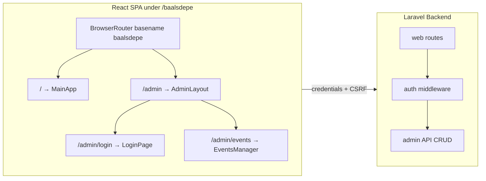

# Admin Panel for to-resume (Auth + Events CRUD)

## Goal

- **Authentication:** Login screen (username/password, centered) and session-based auth; root admin credentials from `YOSHI_ADMIN_NAME` and `YOSHI_ADMIN_PASS` in `.env`.
- **Panel UI:** Modern admin look using **MUI (Material UI)** in the existing React+Webpack app, inspired by [Material Kit React](https://github.com/devias-io/material-kit-react) (sidebar, app bar, cards)—without introducing Next.js.
- **Events CRUD:** Admin section to list, add, edit, and delete events (Laravel `Event` model / `events` table).

---

## 1. Backend: Env and root admin user

- **Add to [.env.example](.env.example):**
  - `YOSHI_ADMIN_NAME=` (admin login username/email)
  - `YOSHI_ADMIN_PASS=` (admin password)
- **Ensure root admin exists:** Use the existing `User` model and `users` table. Create a seeder (e.g. `AdminUserSeeder`) that runs after `EventSeeder` and:
  - Creates or updates a single admin user where `email` = `env('YOSHI_ADMIN_NAME')` and sets `password` to `Hash::make(env('YOSHI_ADMIN_PASS'))`. Use `name` for display (e.g. same as email or "Admin").
  - Guard against empty env (skip or use a default only in non-production). Call this seeder from [database/seeders/DatabaseSeeder.php](database/seeders/DatabaseSeeder.php).
- **Session config:** Ensure admin routes use `web` middleware and sessions (already in place). CSRF: SPA will send CSRF token for state-changing requests (cookie `XSRF-TOKEN` and header `X-XSRF-TOKEN` or Laravel’s default). Verify [config/session.php](config/session.php) and same-site/domain so cookies work when the SPA is under `/baalsdepe`.

---

## 2. Backend: Auth routes and middleware

- **Login / Logout (web):**
  - `POST /baalsdepe/admin/login` — validate `username` (map to User `email`) and `password`, then `Auth::attempt()`; on success return `{ user: { id, name, email } }` and 200; on failure return 401.
  - `POST /baalsdepe/admin/logout` — `Auth::logout()`, invalidate session, return 204 or 200.
- **Auth check for SPA:**
  - `GET /baalsdepe/admin/api/me` (or `/api/admin/me`) — under `web` + `auth:sanctum` or `auth` middleware. Return current user `{ id, name, email }` or 401. This lets the React app know if the user is logged in.
- **Middleware choice:** Use Laravel’s built-in `auth` middleware (session guard). Register routes in [routes/web.php](routes/web.php) so they use `web` middleware and session. No need for Sanctum token for same-origin SPA if you use session-only auth; ensure the SPA sends credentials (e.g. `fetch(..., { credentials: 'include' })`).
- **CSRF:** Laravel’s `web` middleware already verifies CSRF for POST/PUT/DELETE. The single Blade view that boots the SPA can expose a CSRF meta tag or cookie so the React app can send `X-XSRF-TOKEN` with requests (Laravel’s default setup uses cookie name `XSRF-TOKEN` and expects the value in the header).

---

## 3. Backend: Admin Events API (CRUD)

- **Routes (web, under auth):** Prefix e.g. `baalsdepe/admin/api`, middleware `['web', 'auth']`:
  - `GET    /events`       — list events (e.g. ordered by `event_date` desc), JSON.
  - `POST   /events`       — create event; validate `event_date`, `name`, `game`, `url`, `major` (nullable), `role`, `notes` (nullable).
  - `GET    /events/{id}`   — single event (for edit form).
  - `PUT    /events/{id}`   — update event.
  - `DELETE /events/{id}`   — delete event.
- **Controller:** Add `App\Http\Controllers\Admin\EventController` (or extend a resource controller) with `index`, `store`, `show`, `update`, `destroy`. Use Form Requests or inline validation for store/update. Return JSON consistent with the existing public API shape where helpful (e.g. `event_date` as `Y-m-d`, plus `date` formatted for display if desired).
- **Authorization:** All these routes are already protected by `auth`; only the seeded admin (or future users you add) can access. No extra policy needed for the first version unless you want to restrict by role later.

---

## 4. Frontend: Router and auth flow

- **Add React Router:** Install `react-router-dom`. In the SPA entry (e.g. [resources/js/app.jsx](resources/js/app.jsx) or a new wrapper), use `BrowserRouter` with `basename="/baalsdepe"` so paths align with Laravel’s catch-all `Route::get('/baalsdepe/{any?}', ...)`.
- **Route structure:**
  - `/` — existing [MainApp.jsx](resources/js/MainApp.jsx) (public events list).
  - `/admin` — redirect to `/admin/events` or render admin layout (see below).
  - `/admin/login` — login page (centered card, username + password).
  - `/admin/events` — events CRUD section (list + add/edit/delete).
- **Auth context or hook:** Provide an auth context (or a simple hook) that:
  - On mount (and when navigating to `/admin/`*), calls `GET /baalsdepe/admin/api/me` with `credentials: 'include'`.
  - Stores user in state (or context); if 401, set user to `null`.
  - For routes under `/admin` (except `/admin/login`): if user is `null`, redirect to `/admin/login`. After successful login, redirect to `/admin/events`.
- **Fetch defaults:** Ensure all admin API calls use `credentials: 'include'` and send CSRF token (e.g. read from cookie and set `X-XSRF-TOKEN` header) for POST/PUT/DELETE.

---

## 5. Frontend: MUI and layout (Material-Kit-style)

- **Add MUI:** Install `@mui/material` and `@emotion/react` / `@emotion/styled` (peer deps). No need to add Next.js or the full Material Kit React repo; we only adopt the visual language and layout patterns in the existing React+Webpack app.
- **Theme:** Create a small MUI theme (optional dark/light toggle later). Use it in a `ThemeProvider` wrapping the admin subtree (or the whole app).
- **Login screen:** A single centered view (e.g. full-height flex container, center a MUI `Card` with `TextField` for username, `TextField` type password, and a submit `Button`). On submit, POST to `/baalsdepe/admin/login`; on success update auth state and redirect to `/admin/events`; on failure show error message.
- **Admin layout:** For `/admin` and `/admin/events`, render a layout inspired by Material Kit:
  - **App bar** at top (e.g. “Admin” title + logout button).
  - **Sidebar** (drawer) with nav items: “Events” (link to `/admin/events`). Optional: “Dashboard” later.
  - **Main content** area where child routes render (events list + dialogs for add/edit).
- **Events section:**
  - **List:** MUI `Table` (or `DataGrid` if you add it) showing event date, name, game, role, major, and actions (Edit, Delete).
  - **Add:** Button “Add event” opens a **Dialog** (or inline form) with fields: event_date (date picker or text), name, game, url, major, role, notes. Submit POST to create, then refresh list.
  - **Edit:** Per-row “Edit” opens a dialog pre-filled with the event; submit PUT to update.
  - **Delete:** “Delete” with confirmation dialog; on confirm, DELETE then refresh list.
- **Date handling:** Use MUI `DatePicker` if you add `@mui/x-date-pickers` (and adapter e.g. `date-fns`), or a simple text input for `YYYY-MM-DD` to match the `event_date` column. Format display in the table as you do on the public side (e.g. “M jS, Y”).

---

## 6. Files to add or change (summary)

| Area                                              | Action                                                                                                                                                                                     |
| ------------------------------------------------- | ------------------------------------------------------------------------------------------------------------------------------------------------------------------------------------------ |
| `.env.example`                                    | Add `YOSHI_ADMIN_NAME`, `YOSHI_ADMIN_PASS`.                                                                                                                                                |
| `database/seeders/AdminUserSeeder.php`            | Create/update admin user from env.                                                                                                                                                         |
| `database/seeders/DatabaseSeeder.php`             | Call `AdminUserSeeder`.                                                                                                                                                                    |
| `routes/web.php`                                  | Add admin login/logout and `admin/api/me` and admin events CRUD under `baalsdepe` with `web` + `auth`.                                                                                     |
| `app/Http/Controllers/Admin/LoginController.php`  | `login`, `logout`.                                                                                                                                                                         |
| `app/Http/Controllers/Admin/EventController.php`  | `index`, `store`, `show`, `update`, `destroy`.                                                                                                                                             |
| `resources/js/app.jsx`                            | Wrap app in `BrowserRouter` (basename `/baalsdepe`), define routes: `/` → MainApp, `/admin/login` → LoginPage, `/admin` → AdminLayout (with nested route `/admin/events` → EventsManager). |
| `resources/js/contexts/AuthContext.jsx` (or hook) | Fetch `/baalsdepe/admin/api/me`, expose user + login/logout helpers.                                                                                                                       |
| `resources/js/pages/Admin/LoginPage.jsx`          | Centered MUI card, form, submit to login.                                                                                                                                                  |
| `resources/js/pages/Admin/AdminLayout.jsx`        | App bar + sidebar + outlet for nested routes; auth guard redirect to login.                                                                                                                |
| `resources/js/pages/Admin/EventsManager.jsx`      | Table, Add/Edit/Delete dialogs, calls admin events API.                                                                                                                                    |
| `package.json`                                    | Add `react-router-dom`, `@mui/material`, `@emotion/react`, `@emotion/styled`; optionally `@mui/x-date-pickers` and `date-fns`.                                                             |
| `resources/views/app.blade.php`                   | Ensure CSRF meta tag is present for the SPA (e.g. `<meta name="csrf-token" content="{{ csrf_token() }}">`) if you use it for header.                                                       |

---

## 7. Optional refinements

- **Role options:** Reuse [resources/js/constants.js](resources/js/constants.js) (e.g. `ROLE_OPTIONS`, `GAME_OPTIONS`) in the admin event form for dropdowns.
- **Validation:** Backend Form Requests for store/update; optional client-side validation in the event form.
- **Logout:** Call `POST /baalsdepe/admin/logout` with credentials and CSRF, then clear auth state and redirect to `/admin/login`.

---

## Architecture (high level)

This keeps the admin panel inside the existing Laravel-served React app, uses session auth and env-based root admin, and delivers a Material-Kit-style UI with MUI plus full Events CRUD.